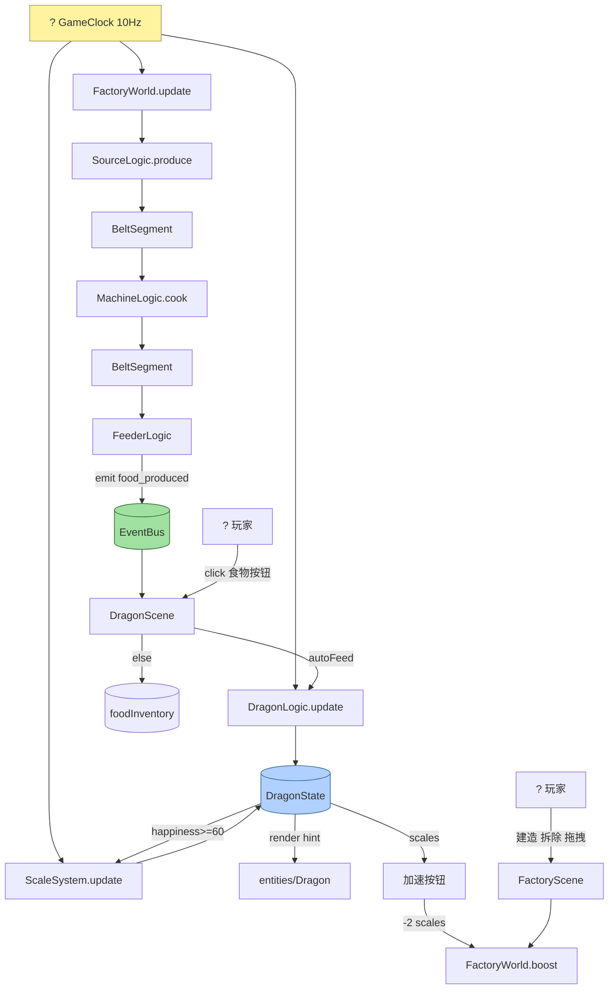

# ? 龙宝宝工厂养成游戏 ― 工程总览

> 上次更新：2026-06-18（第二轮代码 Review 后整体复盘）

---

## 1?? 一句话定位

> **一个用 Phaser 3.80 + TypeScript 构建的 1024×768 单页 Web 游戏**――左屏养龙（喂食 / 抚摸 / 心情系统），右屏建工厂（采集 → 配方 → 传送带 → 喂食仓），工厂产出可自动喂龙、龙的满意度产出"龙鳞"作为建造货币，形成正向循环。

---

## 2?? 技术栈

| 层 | 选型 | 备注 |
|---|---|---|
| 引擎 | **Phaser 3.80.1** | Canvas/WebGL 自动选择 |
| 语言 | **TypeScript 5.4** | `strict` + `noUnusedLocals/Parameters` |
| 构建 | **Vite 5.2** | 端口 3000，base `./` 支持静态部署 |
| 目标 | ES2020 / ESM | 现代浏览器 |
| 依赖 | **零业务依赖** | 仅 phaser 一个 runtime 包 |

整个工程**没有任何额外的状态管理库、UI 库、动画库**――所有交互、物理、数据流都是手写在 Phaser 之上，便于调试和裁剪。

---

## 3?? 文件全景（按职责分层）

```
src/  (~150KB, 18 个 .ts 文件)
│
├─ ? 配置层 (data/)            ── 纯数据，可任意改
│   ├─ GameConfig.ts            (8.6KB)  全局参数（速率/阈值/网格）
│   ├─ FoodData.ts              (1.0KB)  3 种食物数值
│   ├─ DialogueData.ts          (1.0KB)  4 类台词池
│   └─ BuildableDef.ts          (1.7KB)  8 种可建造建筑
│
├─ ? 纯逻辑层 (core/)           ── 不依赖 Phaser，可单测
│   ├─ dragon/
│   │   ├─ DragonState.ts       (1.7KB)  数据 + mood 计算属性
│   │   └─ DragonLogic.ts       (2.4KB)  饥饿/满意度 tick + feed
│   └─ factory/
│       ├─ Item.ts              (1.0KB)  7 种物品类型
│       ├─ Recipe.ts            (1.5KB)  3 个配方（唯一来源）
│       ├─ MachineStatus.ts     (0.4KB)  状态枚举
│       └─ FactoryWorld.ts      (24KB)   ? 工厂引擎（Source/Machine/Belt/Feeder）
│
├─ ? 系统层 (systems/)          ── 横切系统，由 GameClock 驱动
│   └─ ScaleSystem.ts           (1.8KB)  龙鳞自动产出
│
├─ ? 渲染层 (entities/)         ── 仅负责画
│   └─ dragon/
│       ├─ Dragon.ts            (16KB)   ? 龙渲染 + 7 种动画
│       ├─ IdleBehaviors.ts     (1.3KB)  空闲行为权重表
│       └─ SpeechBubble.ts      (3.4KB)  气泡（带 follow）
│
├─ ? 场景层 (scenes/)           ── Phaser Scene，做粘合
│   ├─ BootScene.ts             (2.2KB)  ? 启动 + 共享数据
│   ├─ DragonScene.ts           (23KB)   ? 龙宝宝主场景
│   ├─ FactoryScene.ts          (56KB)   ? 工厂主场景（最大）
│   └─ HUDScene.ts              (3.5KB)  ? HUD + 驱动 GameClock
│
├─ ? events/EventBus.ts        (2.3KB)  全局事件总线
├─ ? utils/GameClock.ts         (4.3KB)  10Hz 逻辑帧
├─ ? main.ts                   (0.9KB)  Phaser Game 入口
└─ ? ui/                       ── 空目录，未来 UI 组件
```

---

## 4?? 架构核心理念（五条主线）

### ① 双频时钟分离

```
渲染帧 60fps    ── Scene.update()  → 画面平滑、动画 tween
逻辑帧 10fps    ── GameClock.onTick → 数据计算、生产推进
                               ↑
                    HUDScene 永不 sleep，单点驱动
```

渲染层用 `getSubTickFraction()` 在两次 tick 之间插值，保证 60fps 视觉但 CPU 只跑 10Hz 模拟。

### ② 逻辑/渲染严格分层

- `core/` 是纯 TS 类，没有一行 `import Phaser`
- `entities/` 和 `scenes/` 才依赖 Phaser
- 测试核心规则可以直接 `new DragonLogic()` 不用启动游戏

### ③ 单例数据 + Registry 共享

```
BootScene
  └ registry.set('dragonState', new DragonState())  ─┬→ DragonScene  (读)
  └ registry.set('factoryWorld', ...)                ├→ FactoryScene (读+改)
  └ registry.set('foodInventory', {...})             └→ HUDScene     (只读)
```

所有场景拿到的是**同一个引用**，跨场景修改即时可见。

### ④ EventBus 解耦工厂与龙

```
DragonFeederLogic.update()
    └─ EventBus.emit('food_produced', { foodId })
              ↓
    DragonScene 监听 → 自动喂食 OR 入库存
```

工厂不需要知道龙的存在；龙不需要轮询工厂。

### ⑤ 端口拓扑式工厂模型

```
SourceLogic ─┐
             ├─ BeltSegment (queue<{type, remaining}>) ─→ MachineLogic
             │                                              ↓
             └─ ...                                     OutputBuffer
                                                            │
                                                       BeltSegment ─→ FeederLogic
```

- 每个实体有 `pullOutput(port)` / `receiveInput(item, port)` / `canAcceptInput(port)` 三件套
- 传送带是松耦合的"管道"，不知道两端是什么
- 添加分流器/合并器只需新增同接口的实体类

---

## 5?? 系统功能矩阵

| 模块 | 实现度 | 核心代码位置 |
|---|---|---|
| **龙宝宝渲染** | ? 完整 | `Dragon.ts` ― 7 种动画（呼吸/吃食/跳跃/打哈欠/张望/伸懒腰/打喷嚏/睡觉） |
| **饥饿 / 满意度 / 心情** | ? 完整 | `DragonLogic` + `DragonState.mood` |
| **手动喂食 + 飞行动画** | ? 完整 | `DragonScene.handleFeedClick` |
| **自动喂食模式** | ? 完整 | 阈值由 `AUTO_FEED_HUNGER_THRESHOLD` 控制 |
| **抚摸 / 单击 / 连点反应** | ? 完整 | 长按 500ms 触发抚摸，连点 3/10 次不同反应 |
| **表情气泡（跟随龙）** | ? 完整 | `SpeechBubble.follow()` |
| **龙鳞产出** | ? 完整 | `ScaleSystem` 满意度驱动 |
| **工厂 5 源 / 3 机 / 1 仓** | ? 完整 | `createDefaultFactory()` |
| **3 种配方** | ? 完整 | 面包 / 肉 / 蛋糕 |
| **传送带（防穿透）** | ? 完整 | `BeltSegment.update()` 用 `blockMin` 占位约束 |
| **生产加速（消耗龙鳞）** | ? 完整 | `BOOST_MULTIPLIER=2x, 30s` |
| **建造 / 拆除（grid 吸附）** | ? 完整 | B 键 + 工具栏 + 占用格检查 |
| **传送带可视化连线编辑** | ? 完整 | E 键 + 端口高亮 + 环检测 |
| **建筑可拖拽（建造模式）** | ? 完整 | `tryStartBuildingDrag` + 自动重排传送带 |
| **双相机（世界缩放 + UI 固定）** | ? 完整 | `worldLayer` + `uiCam` |
| **WASD / 中键 / 滚轮 相机** | ? 完整 | `handleWASDCamera` |
| **场景切换（Tab + sleep/wake）** | ? 完整 | 切换时不重建场景，只暂停渲染 |
| **shutdown 资源清理** | ? 完整 | `tickUnsub` / `foodProducedUnsub` |
| 启动画面 / 龙蛋孵化 | ? 待做 | prompt Step 1 |
| 龙偏好系统（最爱食物） | ? 待做 | prompt Step 5 |
| 配方切换 UI | ? 待做 | 目前机器配方固定 |
| 分流 / 合并 / 地下传送带 | ? 故意延后 | MVP 不要 |
| 存档 / 音效 | ? 故意不做 | prompt 明确 |

---

## 6?? 工程质量评估

### ? 做得好的地方

| 方面 | 表现 |
|---|---|
| **零 lint 错误** | 严格模式下整个 `src/` 通过 |
| **架构分层清晰** | core / systems / entities / scenes 边界明确 |
| **配置驱动** | 所有数值集中在 `GameConfig.ts`，调平衡不改逻辑 |
| **数据唯一来源** | 配方只在 `Recipe.ts`、初始库存只在 `GameConfig` |
| **生命周期管理** | 所有订阅都有 `shutdown` 清理钩子 |
| **注释密度高** | 每个类/方法有职责说明 + UE 类比帮助理解 |
| **健壮性意识** | EventBus 异常隔离、GameClock 死亡螺旋保护、传送带容量上限 |
| **性能意识** | 60fps 只画 / 10Hz 才计算、文字仅在变化时 setText |

### ?? 仍有改进空间

| 问题 | 严重度 | 建议 |
|---|---|---|
| `FactoryScene.ts` 1275 行 / 56KB **过大** | ? | 拆出 `BuildSystem.ts`、`BeltEditor.ts`、`FactoryRenderer.ts` 三个子模块 |
| `Dragon.ts` 一个类承担渲染+7 种动画 | ? | 把 idle 行为拆到 `DragonAnimations.ts` 文件 |
| `src/ui/` 空目录但已规划 | ? | 待 UI 组件抽离时填充 |
| 没有任何单元测试 | ? | core/ 层是纯 TS，加 vitest 成本极低 |
| `pickIdleBehavior` 等纯函数没测试 | ? | 加权随机的边界容易出 bug |
| `BeltSegment.maxCapacity = length × 2` 是隐含设计 | ? | 提到 GameConfig 让数值可调 |
| `MachineLogic` 端口数硬编码 3 | ? | 改配方后想要 2 输入 1 输出就要重构 |
| 没有错误边界 / 全局异常处理 | ? | window.onerror + 友好提示 |
| 没有 README 说明如何运行 | ? | 加上 `npm i && npm run dev` 三行说明 |

---

## 7?? 模块复杂度排序（按"代码量 vs 职责"）

```
? 高复杂度（值得重点关注）
└─ FactoryScene.ts          1275 行   渲染+建造+编辑+拖拽+UI 全在一起
└─ FactoryWorld.ts            700 行   ? 已合理拆分为 4 个 Logic 类
└─ Dragon.ts                  464 行   ? 渲染 + 7 种动画混在一起

? 中复杂度
└─ DragonScene.ts             626 行   场景 + 喂食 + 互动 + 气泡
└─ GameConfig.ts              165 行   纯配置，复杂度=分类多

? 低复杂度（实现优雅）
└─ GameClock.ts               130 行   单一职责
└─ EventBus.ts                 90 行   极简单例
└─ ScaleSystem.ts              64 行   纯函数式
└─ 其他 data/ core/ 文件        多在 50 行内
```

---

## 8?? 数据流总图



---

## 9?? 场景生命周期

```
BootScene.create()
  ├── 创建 GameClock(TICK_RATE) + EventBus
  ├── 创建 DragonState 实例 → registry.set('dragonState', ...)
  ├── 创建 foodInventory (拷贝自 GameConfig.INIT_FOOD_INVENTORY)
  ├── start DragonScene (active)        ← Tab 切换
  ├── launch + sleep FactoryScene       ← Tab 切换 wake
  └── launch HUDScene (always active)   ← 驱动 GameClock + 顶部状态栏
```

---

## ? 关键算法笔记

### 传送带防穿透（`BeltSegment.update`）

```
情况 1：正常前进（无阻塞）
  before: [A:5, B:7, C:9]
  after : [A:4, B:6, C:8]   ← 全部 -1

情况 2：A 卡在终点（remaining=0），B/C 不应穿过
  before: [A:0, B:1, C:3]
  after : [A:0, B:1, C:2]   ← B 紧贴 A（=blockMin+1=1），C 正常前进
```

`blockMin` 表示前一个物品占用的最近格，约束后方物品 `remaining ≥ blockMin + 1`。

### Machine 输出空间检查

不能用 "端口剩余总和 ≥ 产物数量" 判断（会忽略端口绑定）。  
正确做法：复制一份 `simulatedFree[]`，按 `completeProduction` 的端口 0→1→2 顺序模拟一次填入，能塞下才放行。

### Source Timer 截断

缓冲区满时把 `timer` 截断到 `≤ effectiveInterval`，避免长期满载后清空时**瞬间爆产**。这是有意行为：不补产已经过去的产能。

---

## 1??1?? 最近两轮 Review 累计成果

| 维度 | 开始时 | 现在 |
|---|---|---|
| 已知 Bug | 5 个 | **0** ? |
| 数据/常量重复定义 | 3 处（RECIPE_CONFIGS / mood 阈值 / autoFeed 阈值） | **0** ? |
| Lint 错误 | 0 | **0** ? |
| 文档同步度 | 部分过期（TICK_RATE 错误等） | **完全同步** ? |
| 跨场景状态一致性 | BootScene 写入会被覆盖 | **单一来源** ? |
| 传送带阻塞穿透 | 存在 | **已修复** ? |

### 已修复问题清单（共 12 项）

| # | 类型 | 问题 | 修复 |
|---|------|------|------|
| 1 | Bug | `DragonLogic.feed()` 心情变化日志打印两个相同值 | 用 `oldMood`/`newMood` 临时变量 |
| 2 | Bug | `Dragon.playJump()` chain 第二段依赖 `this.y` 时序 | 显式锁定 `const baseY` |
| 3 | Bug | Machine 输出空间检查忽略端口绑定 | 改为按端口顺序模拟填入 |
| 4 | Bug | 传送带阻塞时后方物品穿透队首 | `blockMin` 占位约束 |
| 5 | 文档 | `SourceLogic.update` 截断逻辑不易理解 | 补充详细注释 |
| 6 | 一致 | RECIPE_CONFIGS 与 RECIPES 双重定义 | 删除 GameConfig 中的重复 |
| 7 | 一致 | DragonState.mood 阈值硬编码 | 改为 import GameConfig 常量 |
| 8 | Bug | BootScene 写 plain object 后被覆盖 + GameClock(10) 硬编码 | 直接 `new DragonState()` + 读 TICK_RATE |
| 9 | UX | SpeechBubble 不跟随龙 | 增加 `follow()` + `preUpdate` |
| 10 | 一致 | autoFeed `hunger ≤ 20` 硬编码 | 提取 `AUTO_FEED_HUNGER_THRESHOLD` |
| 11 | 整理 | `removeSource/Machine/Feeder` 重复 filter | 封装 `removeBeltsBy` |
| 12 | 文档 | OVERVIEW 过期 | 同步更新 |

---

## 1??2?? 推荐下一步（按 ROI 排序）

| 优先级 | 任务 | 预计工作量 | 价值 |
|---|---|---|---|
| ? 1 | **拆分 `FactoryScene.ts`** 成 3 个子模块 | 半天 | 可维护性飙升 |
| ? 2 | **加 Vitest** 测 core/ 层（DragonLogic/MachineLogic/BeltSegment） | 半天 | 防回归 |
| ? 3 | **启动画面 + 龙蛋孵化** | 半天 | UX 体验完整 |
| 4 | **龙偏好系统**（最爱食物 ×2 加成） | 2 小时 | 玩法深度 |
| 5 | **README.md** 加上运行说明 | 10 分钟 | 上手门槛 |
| 6 | **配方切换 UI** | 半天 | 工厂可玩性 |
| 7 | **`Dragon.ts` 拆分动画文件** | 2 小时 | 代码整洁 |

---

## 1??3?? 配置参数速查（GameConfig.ts）

| 参数 | 值 | 说明 |
|------|------|------|
| `TICK_RATE` | 10 | 逻辑帧频率 Hz |
| `DRAGON_INIT_HUNGER` | 50 | 饥饿度初始值 |
| `DRAGON_INIT_HAPPINESS` | 50 | 满意度初始值 |
| `DRAGON_INIT_SCALES` | 10 | 龙鳞初始数量 |
| `DRAGON_HUNGER_RATE` | 0.3 | 饥饿增长/秒 |
| `DRAGON_HAPPINESS_DECAY` | 0.2 | 满意度衰减/秒 |
| `AUTO_FEED_HUNGER_THRESHOLD` | 20 | 自动喂食触发饥饿阈值 |
| `MOOD_HAPPY_HAPPINESS` | 80 | 开心心情阈值 |
| `MOOD_HAPPY_MAX_HUNGER` | 50 | 开心要求的最大饥饿度 |
| `MOOD_HUNGRY_THRESHOLD` | 70 | 饥饿心情阈值 |
| `MOOD_UNHAPPY_THRESHOLD` | 30 | 不开心心情阈值 |
| `SCALE_MIN_HAPPINESS` | 60 | 产龙鳞最低满意度 |
| `SCALE_INTERVAL_NORMAL` | 5s | 普通产龙鳞间隔 |
| `SCALE_INTERVAL_HAPPY` | 3s | 高满意产龙鳞间隔 |
| `BOOST_MULTIPLIER` | 2.0 | 加速倍率 |
| `BOOST_DURATION_TICKS` | 300 | 加速持续 tick |
| `BOOST_SCALE_COST` | 2 | 加速消耗龙鳞 |
| `GRID_CELL_SIZE` | 32px | 网格单元格大小 |
| `DEMOLISH_REFUND` | 0.5 | 拆除返还比例 |

---

## 1??4?? 快捷键

| 按键 | 功能 | 场景 |
|------|------|------|
| Tab | 切换 Dragon/Factory 场景 | 全局 |
| B | 进入/退出建造模式 | Factory |
| E | 进入/退出传送带编辑模式 | Factory |
| ESC | 退出当前模式 | Factory |
| WASD | 移动相机（建造/编辑模式禁用） | Factory |
| 滚轮 | 相机缩放 0.5x~2.0x | Factory |
| 中键拖拽 | 相机平移 | Factory |
| 右键 | 拆除建筑/传送带 | Factory |
| 左键长按龙 | 抚摸（500ms 触发） | Dragon |

---

## 总评

> **一份高质量的原型代码**：架构清晰、注释充分、配置集中、关键算法（双频时钟、传送带防穿透、双相机、网格吸附）都正确。
>
> 当前**最大债务**是 `FactoryScene.ts` 过胖（一个文件 1275 行同时管 8 件事）。
>
> 但这是**继续往下做**还是**先重构**的选择题――如果打算继续添加分流器/配方切换/启动画面这些功能，重构 `FactoryScene` 会是**值得提前的投资**。
